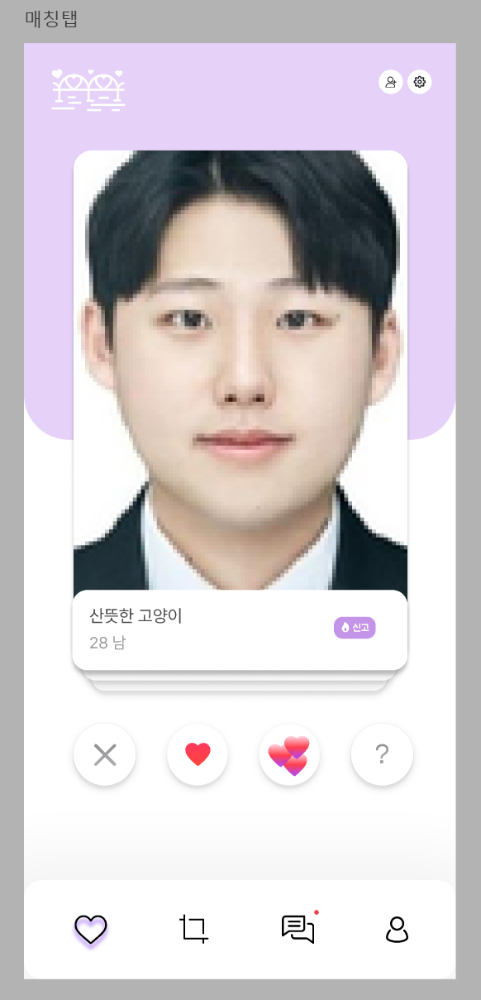

#  ✨ 2024/07/15 (월요일)

## 진행 사항

### 🎨 컨설턴트 반 전체 미팅

JAVASCRIPT에 대한 기초적인 이해 필요 

SPA프레임워크 공부
**react**, vue, Angular순으로 사용

디자인 역량은 있으면 좋지만 필수는 아님

랜더링의 라이프사이클에 대해서 공부 

저장소의 쓰임에 대해서 깊게 생각(MVC -> MVVM)

어떤 프레임워크를 시작하든지 간에 큰 차이는 없고
**공식문서** 참조하기, TODO list 개발 해보기

되도록이면 typescript써보기 (lint)

프레임워크 구현 가능하면 UI/UX 이해와 공부 시작해보기

구글이나 애플의 UI/UX가이드 참조

실무레벨에서 구현이 가능하면 Vanilla javascript를 공부해보기

 

### 🎉 React 스터디

[JIRA 참고한 사이트](https://mollangpiu.tistory.com/365)

 

### 🍞 화면 설계

 

### 🥩 요구 사항 명세서 작성

|구분|기능 depth1|기능 depth2|내용|
|---|---|---|---|
|시스템|알림기능|채팅 알림|채팅이 오면 사용자에게 알림을 보낸다.|
|||추천 카드 알림|매일 같은 시간에 새로운 카드가 제공되고 해당 내용에 대해 알림을 보낸다.|
|사용자 (매칭 OFF)|주선 기능|호감 현황 조회(익명)|나의 지인 2명이 매칭되면 실명/익명으로 된 목록을 조회할 수 있다.  실명/익명 설정은 매칭될 때 매칭된 사용자가 설정할 수 있다.|

 